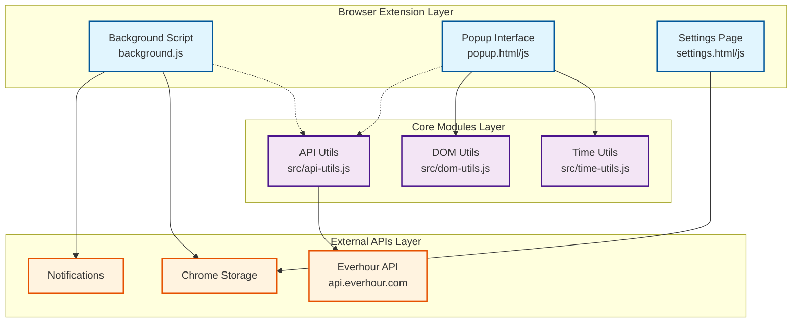
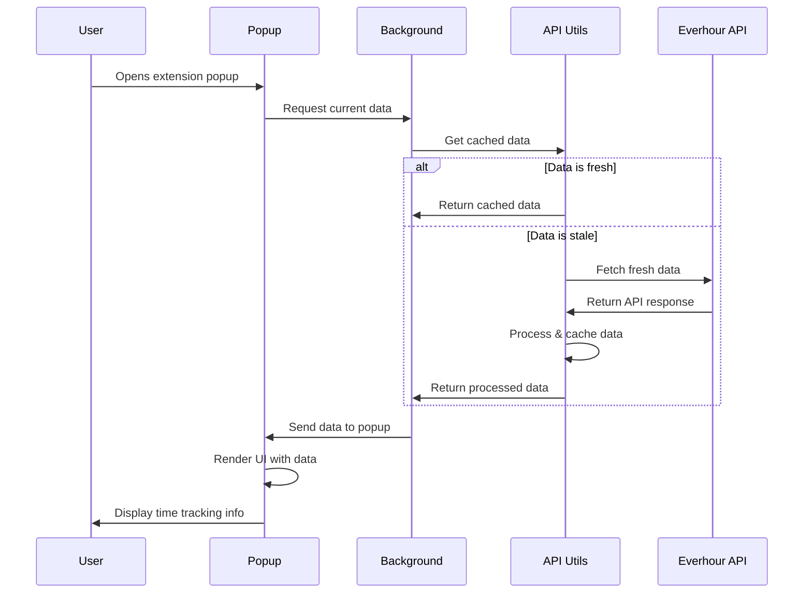
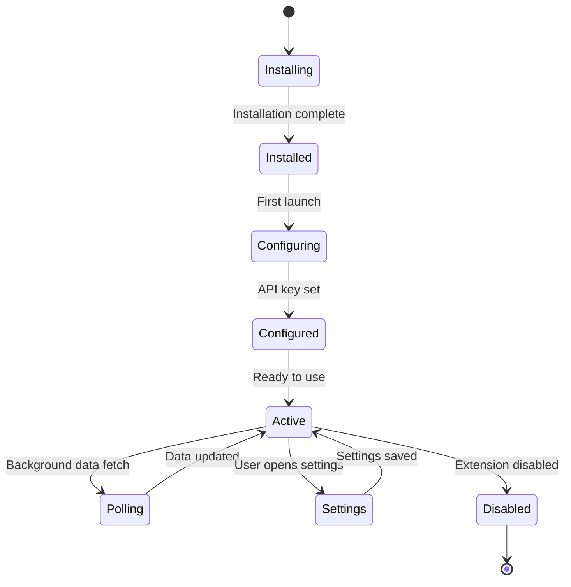
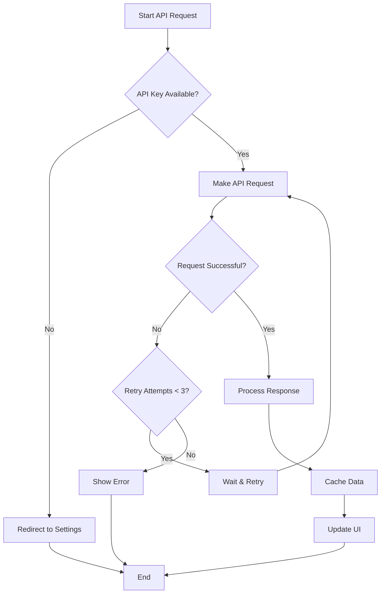
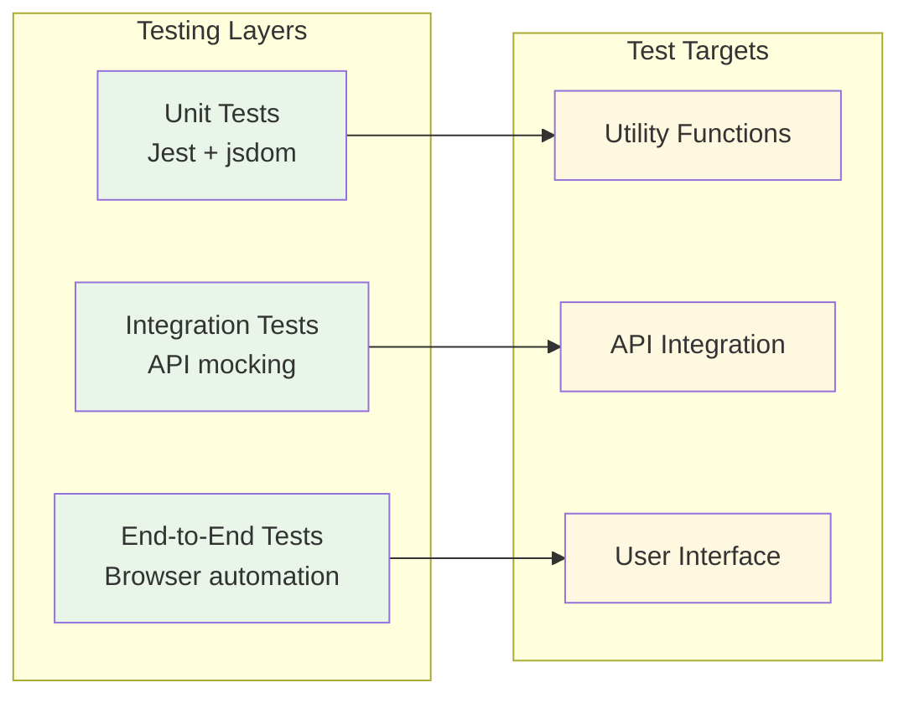

# EverTrack Browser Extension Architecture

## Overview

EverTrack is a browser extension that integrates with the Everhour time tracking API to provide real-time time tracking insights directly in your browser.

## High-Level Architecture



## Component Breakdown

### 1. Browser Extension Components

#### Background Script (`background.js`)
- **Purpose**: Persistent background process for the extension
- **Responsibilities**:
  - Manage extension lifecycle
  - Handle API polling and data fetching
  - Coordinate with browser APIs
  - Send notifications

#### Popup Interface (`popup.html/js`)
- **Purpose**: Main user interface accessible via browser toolbar
- **Responsibilities**:
  - Display current time tracking status
  - Show time summaries and progress
  - Provide quick actions for time tracking

#### Settings Page (`settings.html/js`)
- **Purpose**: Configuration interface for user preferences
- **Responsibilities**:
  - API key management
  - User preference configuration
  - Data persistence settings

### 2. Core Utility Modules

#### Time Utils (`src/time-utils.js`)
- **Purpose**: Time calculation and formatting utilities
- **Key Functions**:
  - `formatHours()` - Convert decimal hours to readable format
  - `getStatus()` - Determine current tracking status
  - `parseTime()` - Parse time strings into standardized format

#### API Utils (`src/api-utils.js`)
- **Purpose**: Everhour API integration and data management
- **Key Functions**:
  - API authentication
  - Data fetching and caching
  - Error handling and retry logic

#### DOM Utils (`src/dom-utils.js`)
- **Purpose**: DOM manipulation and UI utilities
- **Key Functions**:
  - Dynamic element creation
  - Progress bar updates
  - Text formatting and display

## Data Flow Architecture



## File Structure and Responsibilities

```
EverTrack/
├── manifest.json           # Extension configuration
├── background.js           # Background script
├── popup.html             # Main UI template
├── popup.js              # Main UI logic
├── settings.html         # Settings UI template
├── settings.js          # Settings UI logic
├── src/                 # Core utility modules
│   ├── time-utils.js   # Time calculations
│   ├── api-utils.js    # API integration
│   └── dom-utils.js    # DOM utilities
├── tests/              # Unit tests
│   ├── globals.js     # Test environment setup
│   ├── setup.js       # Test configuration
│   └── *.test.js      # Test suites
├── icons/             # Extension icons
└── docs/              # Documentation
```

## Extension Lifecycle



## API Integration Flow



## Development Workflow

```mermaid
gitgraph
    commit id: "Initial Setup"
    commit id: "Add ESLint"
    commit id: "Add TypeScript"
    branch feature
    checkout feature
    commit id: "Implement Feature"
    commit id: "Add Tests"
    commit id: "Fix Issues"
    checkout main
    merge feature
    commit id: "Release"
```

## Testing Architecture



## Security Considerations

- **API Key Storage**: Encrypted storage using Chrome's secure storage API
- **Permissions**: Minimal required permissions in manifest.json
- **Data Handling**: No sensitive data stored in local storage
- **HTTPS Only**: All API communications over secure connections

## Performance Optimizations

- **Data Caching**: Smart caching to reduce API calls
- **Lazy Loading**: Load components only when needed
- **Background Polling**: Efficient polling intervals
- **Memory Management**: Proper cleanup of event listeners

## Contribution Guidelines

1. **Fork & Clone**: Fork the repository and clone locally
2. **Setup**: Run `npm install` and configure development environment
3. **Develop**: Create feature branch and implement changes
4. **Test**: Run `npm test` to ensure all tests pass
5. **Document**: Update documentation for any architectural changes
6. **Submit**: Create pull request with clear description

## Future Architecture Considerations

- **Multi-browser Support**: Abstract browser-specific APIs
- **Modular Architecture**: Consider micro-frontend approach
- **Real-time Updates**: WebSocket integration for live updates
- **Offline Support**: Service worker for offline functionality