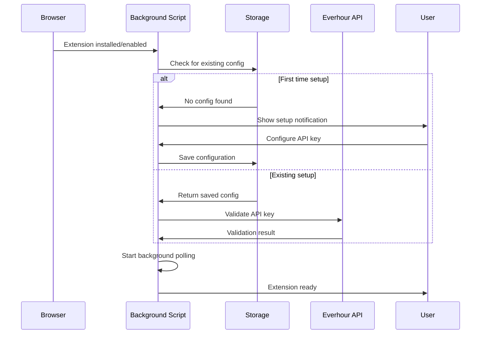
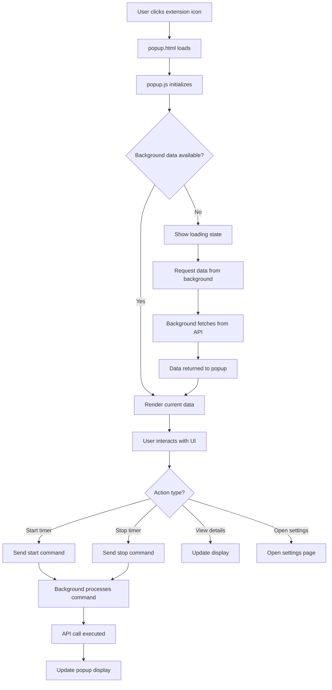
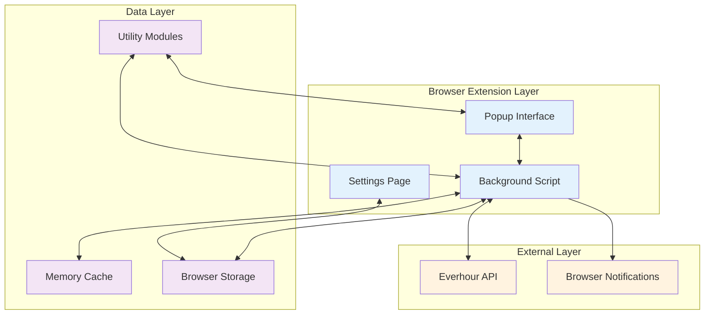
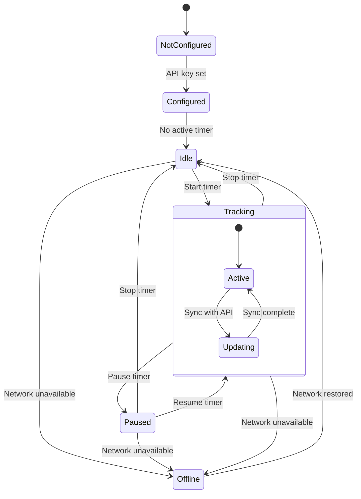
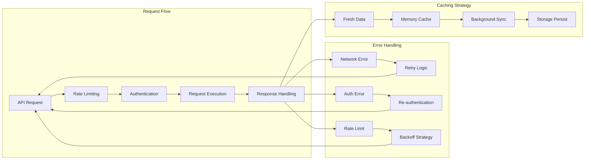
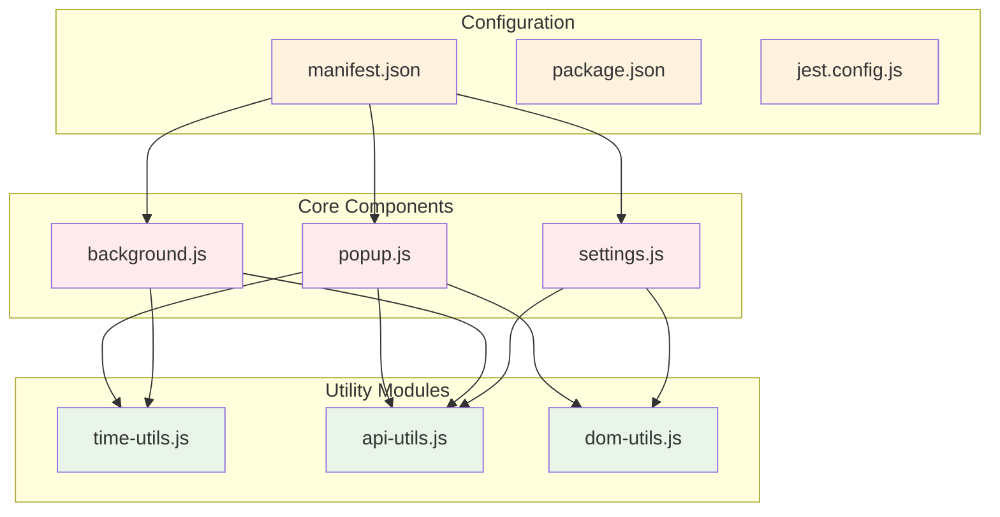
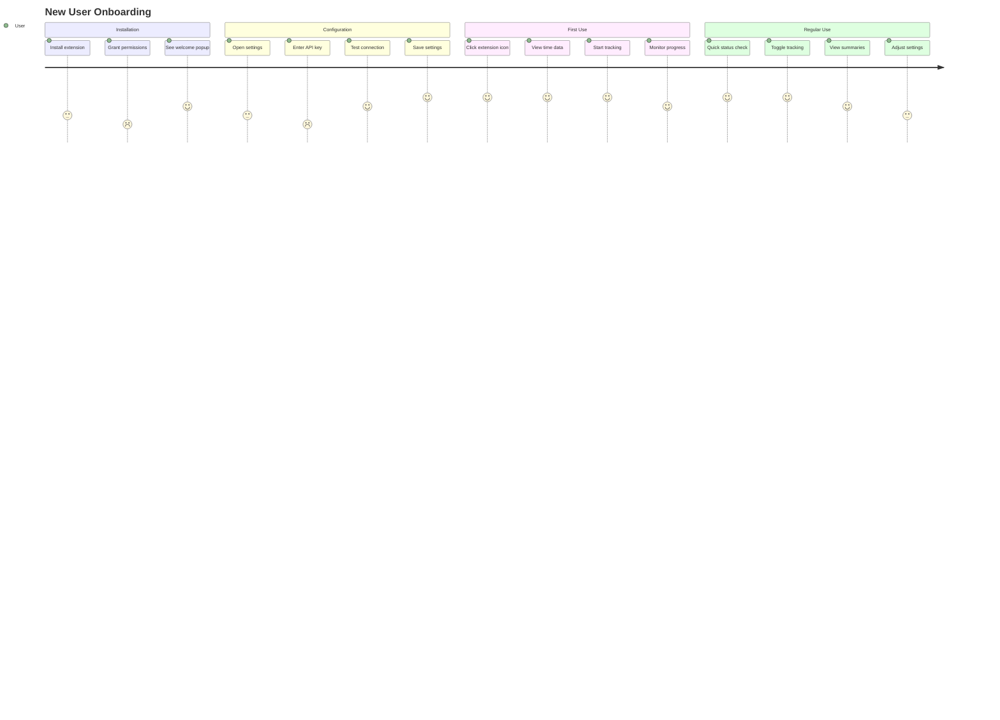
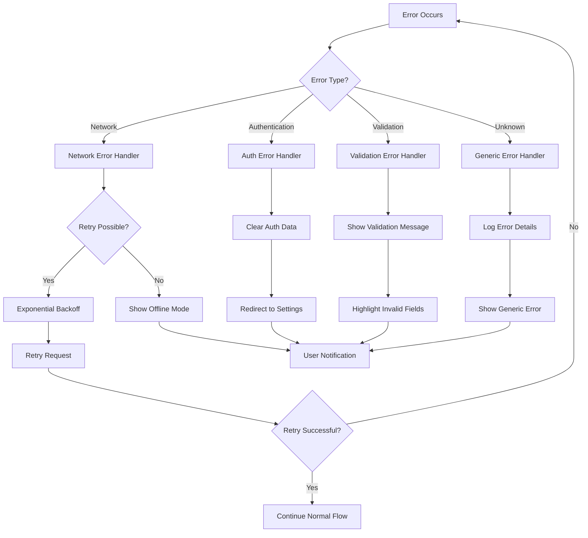
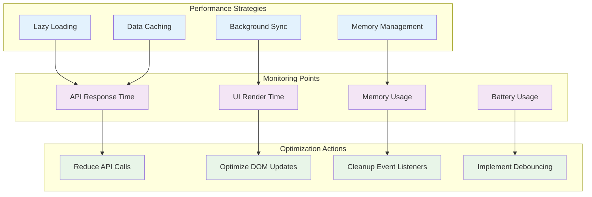

# Component Interaction Diagrams

## System Overview

This document provides detailed visual representations of how EverTrack components interact with each other and external systems.

## 1. Extension Initialization Flow



## 2. Popup Interaction Flow



## 3. Data Flow Architecture



## 4. Time Tracking State Machine



## 5. API Integration Patterns



## 6. Component Dependencies



## 7. User Journey Mapping



## 8. Error Handling Flow



## 9. Performance Optimization Flow



## 10. Testing Strategy Overview

```mermaid
mindmap
  root((Testing Strategy))
    Unit Tests
      Time Utils
        formatHours()
        getStatus()
        parseTime()
      API Utils
        Authentication
        Data Fetching
        Error Handling
      DOM Utils
        Element Creation
        Progress Updates
        Text Formatting
    Integration Tests
      API Integration
        Full Request Flow
        Error Scenarios
        Data Transformation
      Browser Integration
        Extension Loading
        Storage Operations
        Notification System
    End-to-End Tests
      User Workflows
        Installation Flow
        Configuration Setup
        Time Tracking
      Cross-Browser
        Chrome/Edge
        Firefox
        Safari (future)
```

These diagrams provide a comprehensive visual guide for contributors to understand:

1. **System Architecture**: How components interact
2. **Data Flow**: How information moves through the system
3. **User Journeys**: How users interact with the extension
4. **Error Handling**: How the system responds to failures
5. **Performance**: How optimization strategies work
6. **Testing**: How quality assurance is structured

This visual documentation will help new contributors quickly understand the codebase structure and make meaningful contributions.