# Contributor Onboarding Guide

## Welcome to EverTrack!

This guide will help you get up and running with the EverTrack browser extension development environment.

## Quick Start Flowchart

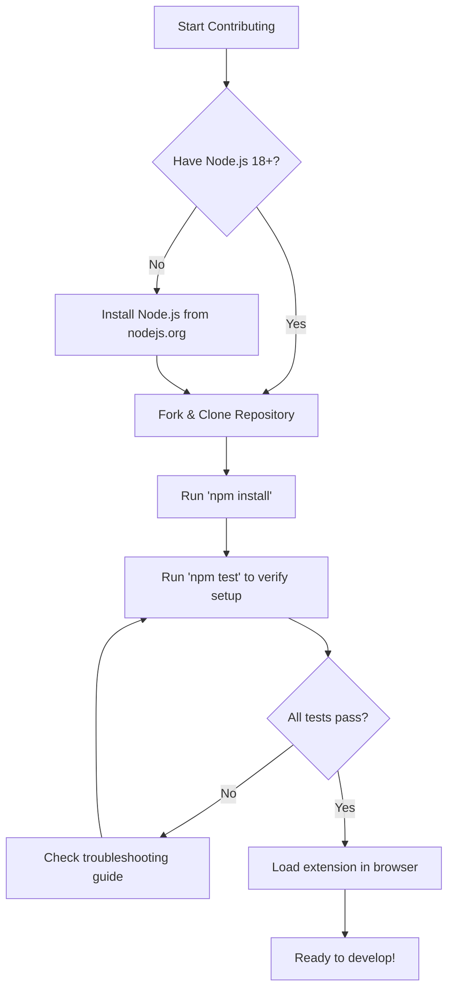

## Development Environment Setup

### Prerequisites

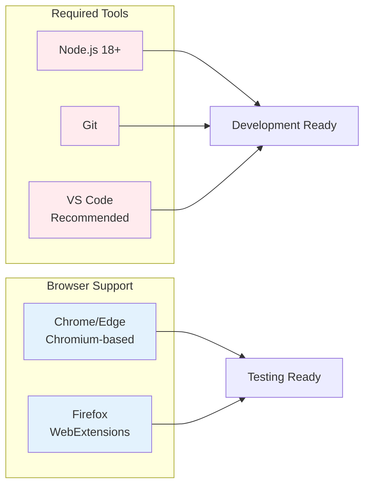

### Step-by-Step Setup

1. **Environment Check**
   ```bash
   node --version  # Should be 18.0.0 or higher
   npm --version   # Should be 9.0.0 or higher
   git --version   # Any recent version
   ```

2. **Repository Setup**
   ```bash
   git clone https://github.com/djretief/ever-track.git
   cd ever-track
   npm install
   ```

3. **Verify Installation**
   ```bash
   npm test  # Runs linting, type checking, and unit tests
   ```

## Codebase Navigation

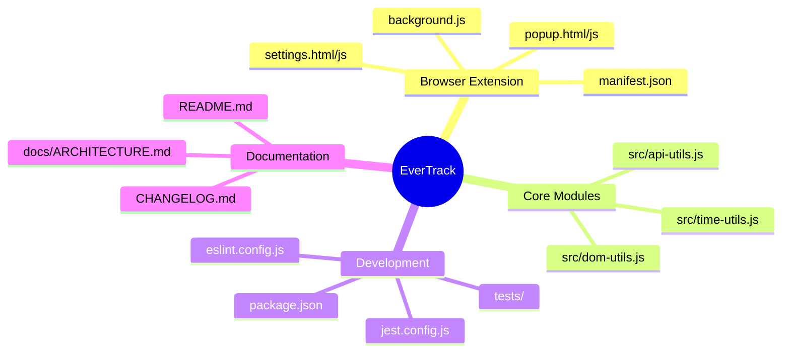

## Development Workflow

```mermaid
gitgraph
    commit id: "Fork repo"
    commit id: "Clone locally"
    branch feature/new-feature
    checkout feature/new-feature
    commit id: "Implement feature"
    commit id: "Add tests"
    commit id: "Update docs"
    commit id: "Run npm test"
    checkout main
    merge feature/new-feature
    commit id: "Feature merged"
```

## Common Development Tasks

### Adding a New Feature

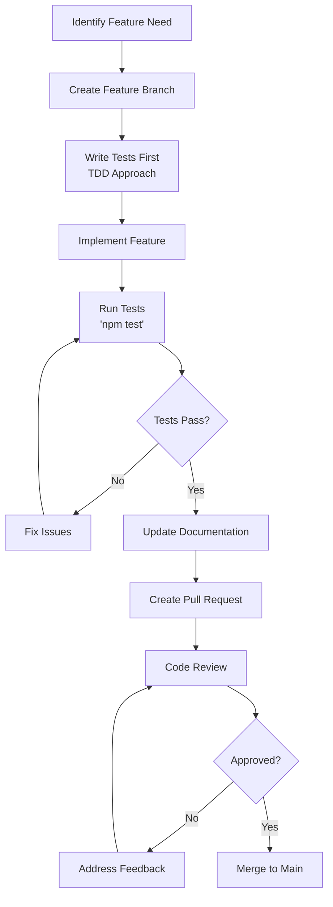

### Bug Fixing Process

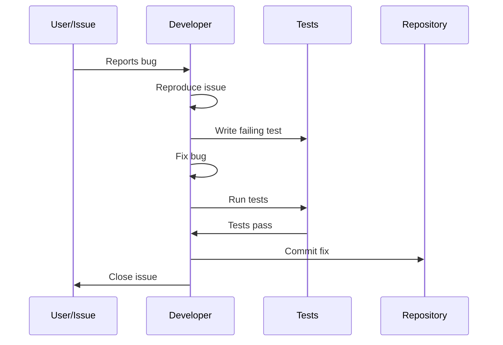

## Code Quality Standards

### Testing Requirements

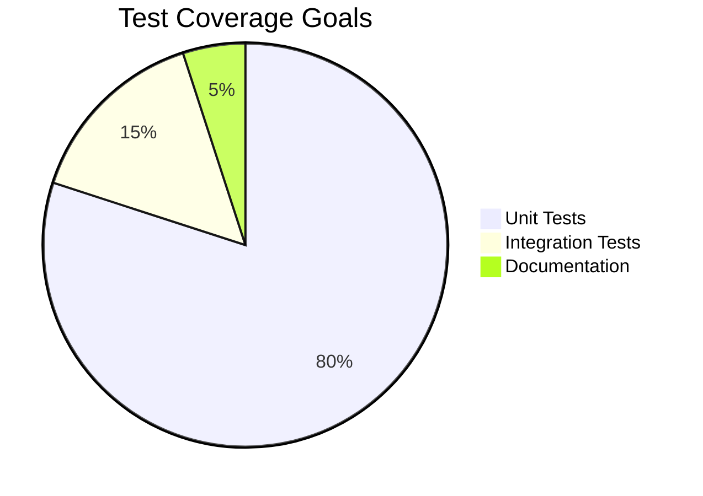

### Code Quality Checklist

- [ ] **ESLint**: No errors (warnings acceptable for console statements)
- [ ] **TypeScript**: All type checks pass
- [ ] **Jest Tests**: All unit tests pass
- [ ] **Documentation**: Updated for new features
- [ ] **Commit Messages**: Clear and descriptive

## Browser Extension Development

### Loading Extension for Testing

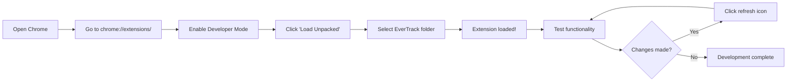

### Extension Architecture Understanding

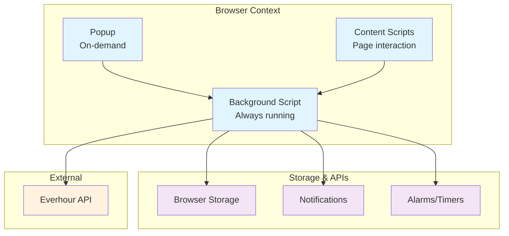

## Module Development Guide

### Time Utils Module (`src/time-utils.js`)

```mermaid
graph LR
    A[Decimal Hours<br/>e.g. 8.75] --> B[formatHours()]
    B --> C[Readable Time<br/>e.g. "8h 45m"]
    
    D[Time String<br/>e.g. "2:30 PM"] --> E[parseTime()]
    E --> F[Normalized Time<br/>Object]
    
    G[Current Status] --> H[getStatus()]
    H --> I[Status String<br/>Working/Break/Done]
```

### API Utils Module (`src/api-utils.js`)

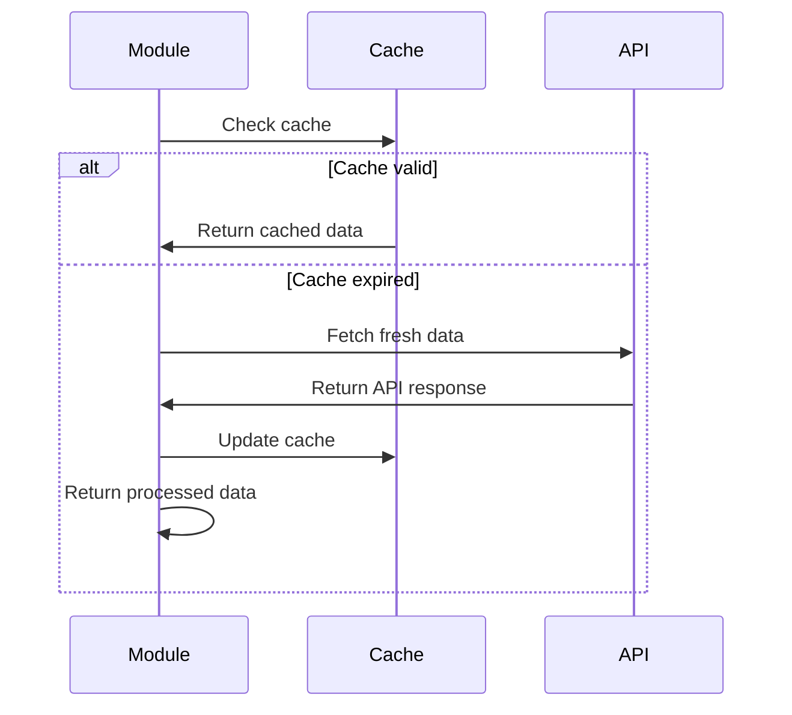

## Testing Your Changes

### Unit Testing

```bash
# Run all tests
npm test

# Run specific test file
npm test -- time-utils.test.js

# Run tests in watch mode
npm test -- --watch
```

### Manual Testing Checklist

- [ ] Extension loads without errors
- [ ] Popup displays correctly
- [ ] Settings page functions properly
- [ ] API integration works
- [ ] Time formatting is accurate
- [ ] No console errors

## Troubleshooting Common Issues

### Jest Module Loading Issues

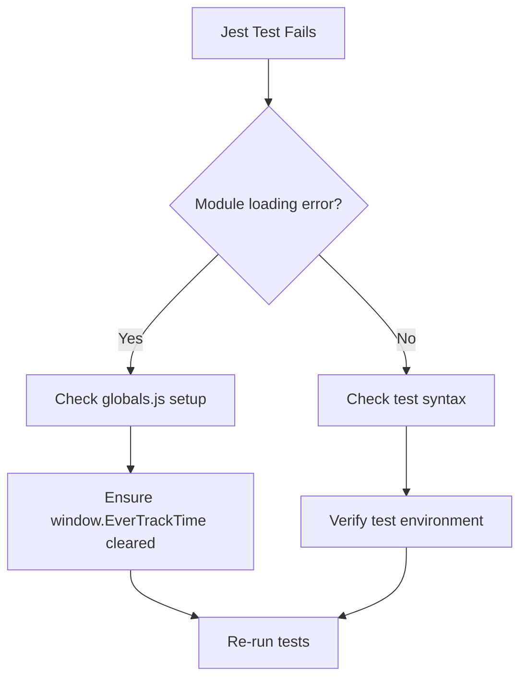

### Extension Loading Issues

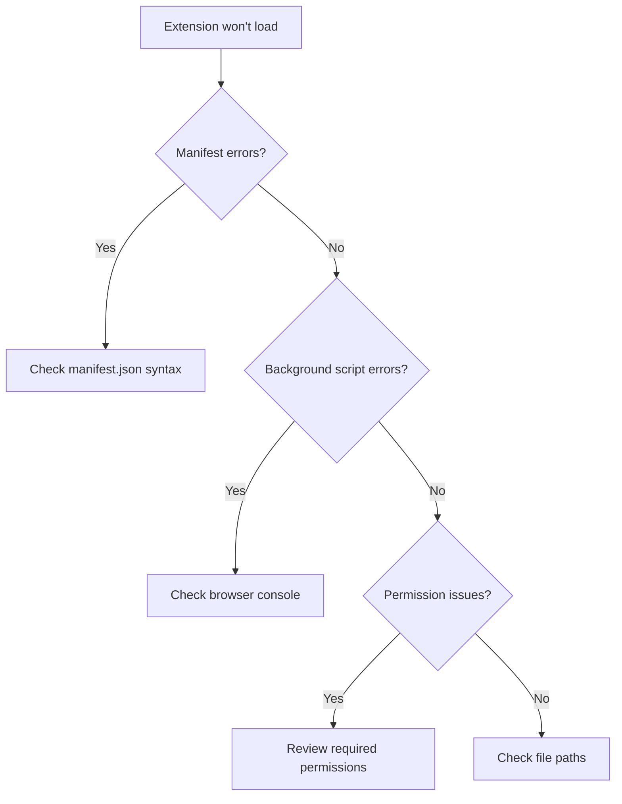

## Getting Help

### Community Resources

- **GitHub Issues**: Report bugs and request features
- **Documentation**: Comprehensive guides in `/docs`
- **Code Comments**: Inline documentation in source files

### Before Asking for Help

1. Check existing GitHub issues
2. Review this documentation
3. Run `npm test` to verify environment
4. Include error messages and steps to reproduce

## Contributing Best Practices

### Code Style

- Follow ESLint configuration
- Use meaningful variable names
- Add JSDoc comments for functions
- Keep functions small and focused

### Commit Guidelines

```
type(scope): description

Examples:
feat(popup): add time tracking summary
fix(api): handle network timeout errors
docs(architecture): add component diagrams
test(utils): add edge cases for time formatting
```

### Pull Request Template

1. **Description**: What does this PR do?
2. **Testing**: How was this tested?
3. **Documentation**: What docs were updated?
4. **Breaking Changes**: Any breaking changes?

## Next Steps

Once you're set up:

1. **Explore the code**: Start with `popup.js` for UI logic
2. **Run tests**: Understand the testing patterns
3. **Check issues**: Look for "good first issue" labels
4. **Ask questions**: Don't hesitate to ask for clarification

Welcome to the team!